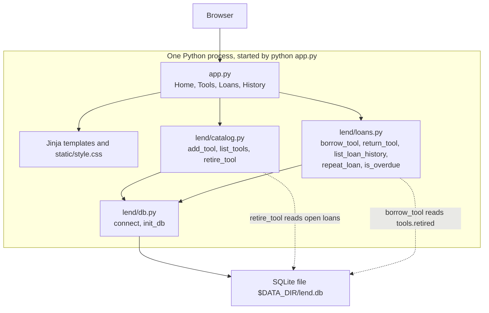

# Lend

Lend is a one-desk tool library for a volunteer workshop. One location, a few dozen tools, and a few hundred loans a year. One Python process and one SQLite file match that load. This report covers how the app was built. The architecture below matches the running process. The database diagram comes in a later section.

## SDLC

I used iterative and incremental delivery. The assignment fixed the constraints before any code: one process, SQLite at one path, two feature domains, and a startup command configured only by environment variables. The design of those domains was not fixed up front. Each day shipped one slice that a volunteer could use, or one check that the slice still worked, and the ADR log recorded the decision that slice forced.

A waterfall plan would have written all five ADR entries on the first day and then built to that document. That would have hidden the real order. Catalog existed before anyone could borrow a tool. The rule that a tool out on loan cannot be retired only became concrete once `loans` had a `returned_at` column. Overdue was computed when the loan list was read, which is also why ADR-5 refuses a reminder worker. Those decisions belong on the days they were made.

The goals below are the ones the repository actually met.

**Startup.** By 30 September the app starts with `python app.py`, binds to `0.0.0.0`, and creates the SQLite file from `PORT` and `DATA_DIR`. `PORT` defaults to 5000. `DATA_DIR` defaults to `data`, and the file is `lend.db` inside that directory. `main` calls `init_db` before it serves requests, so a fresh clone does not need a migration prompt.

**Catalog.** By 30 September a volunteer can add a tool and retire it. `add_tool` stores `retired` as 0. `retire_tool` raises `ToolIsOut` when a loan for that tool still has `returned_at` null. That is the catalog domain: `lend/catalog.py` owns writes to `tools`.

**Loans.** By 5 October a volunteer can register a member, borrow an available tool for seven days, return it, and see Overdue. `borrow_tool` sets `due_at` through `due_at_for`, which adds `LOAN_DAYS` (7) to the borrowed time. `return_tool` sets `returned_at` and does not update `tools`. `is_overdue` is true only when `returned_at` is empty and the current time is past `due_at`. The partial unique index `one_open_loan_per_tool` keeps a second open loan from being inserted.

**Tests.** By 6 October the command `pytest --cov=lend.catalog --cov=lend.loans --cov-report=term-missing` reports 96% on those two modules. The tests call the domain functions on a temporary SQLite file. They do not go through the Flask routes. ADR-4 records that choice: the graded logic is the rules, and the routes only open a connection and render a template.

What this process did not include is a volunteer sitting at the desk and trying the pages. I checked the flows myself: add a tool, retire it, refuse a retire while it is out, borrow, return, and see Overdue on a past due date. That is a developer check, not a user test. The schema diagram comes after these slices, because the tables and the seam between `lend/catalog.py` and `lend/loans.py` were still moving while the features landed.

## Architecture

`python app.py` starts one process. The browser talks only to routes in `app.py`. Those routes render Jinja templates and `static/style.css` from the same process. Tool routes call `lend/catalog.py`. Loan, return, history, and repeat routes call `lend/loans.py`. Both modules ask `lend/db.py` for a connection, and that connection opens `$DATA_DIR/lend.db`.

History is a loans page, not a third domain. `repeat_loan` calls `borrow_tool` inside `lend/loans.py` and inserts a new row. It does not clear `returned_at` on the old loan. `retire_tool` is the only catalog function that reads the `loans` table, and it does that with SQL to refuse a tool that is still out. It does not import `lend/loans.py`. `borrow_tool` reads `tools.retired` the same way, through the shared database file.

